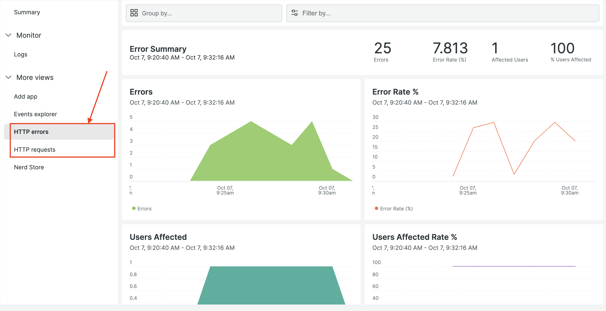
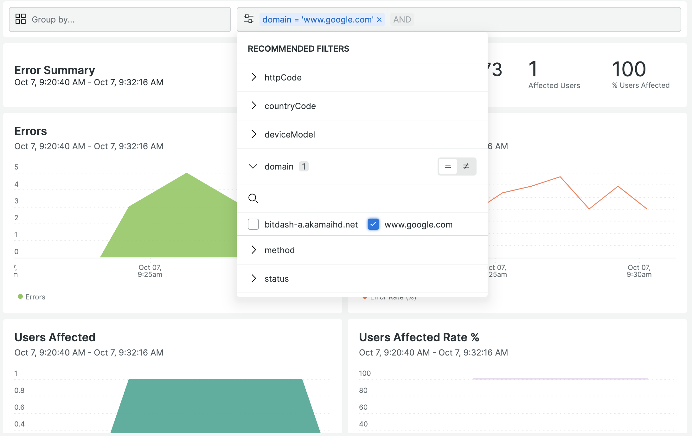
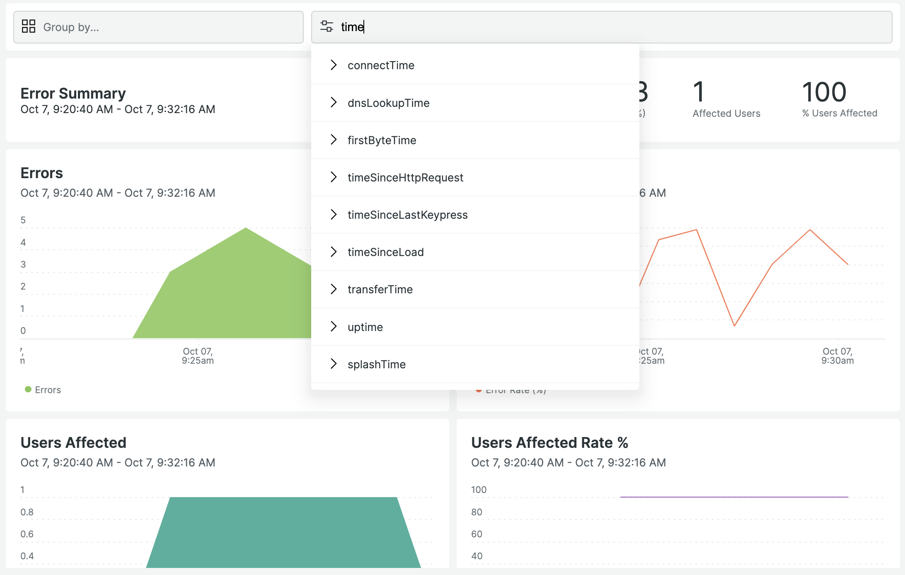
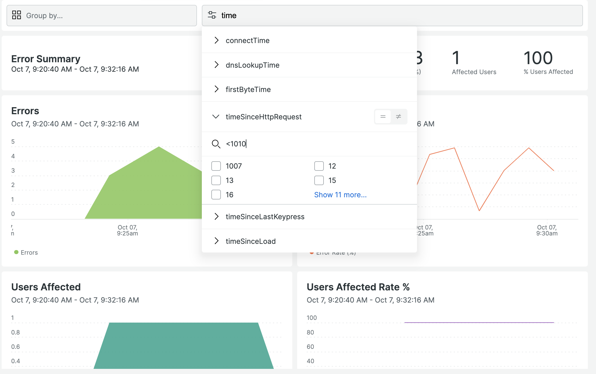

# New Relic Roku HTTP Analytics

The New Relic [Roku observability agent](https://newrelic.com/instant-observability/roku) monitors the system- and video- level performance of Roku over the top (OTT) streaming applications and devices. Specifically, the agent offers insights into an application’s network connectivity, viewer journey, and overall functionality. 

To enhance the experience of the agent, the HTTP Analytics UI will allow you profile and analyze your HTTP errors and durations of requests made by your Roku channel to your backend. Read on to learn how to use the UI!

&nbsp;
## Landing Page

You can access the UI by navigating to your Roku System entity types in the [entity explorer](https://docs.newrelic.com/docs/new-relic-solutions/new-relic-one/core-concepts/new-relic-explorer-view-performance-across-apps-services-hosts/).

Once in the entity, access your HTTP Analytics pages by naviating to them on the left nav bar.

>

The Error Analytics and HTTP Analytics tabs will contain key metrics for profiling the networking behavior of your Roku app.

&nbsp;
## Filter Bar

The top bar contains Grouping and Filtering capabilities.

>

&nbsp;
### Grouping
The Group By box allows you to group the metrics on-screen by the 6 most common attributes used to analyze Roku HTTP data:

- Domain
- Country Code
- Status
- Device Model
- HTTP Method
- HTTP Response Code

>

&nbsp;
### Filtering
The Filter By box allows you to search for and select any attribute value to filter the entire dashboard.

You can begin by clicking the box to select an attribute and clicking the value you want to filter to.
>

You can also begin by typing the name of the attribute you're looking for:
>

If the attribute has a lot of possible values, you can search those as well by using the search bar inside of the dropdown. This is useful for cases like drilling into a specific device model or even UUID:
>

If the attribute represents a range (typical examples are timing data or response codes), you can define a range in the search:
>
